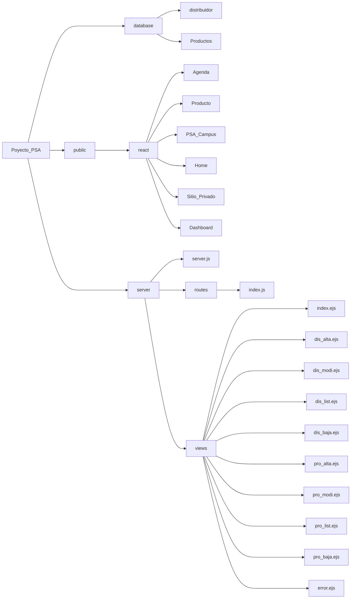

Este proyecto esta armado de la siguiente manera.

```mermaid
flowchart LR
    Poyecto_PSA---->database-->distribuidor
                  database-->Productos

    Poyecto_PSA-->public--->react
                            react-->Agenda
                            react-->Producto
                            react-->PSA_Campus
                            react-->Home
                            react-->Sitio_Privado
                            react-->Dashboard
    
    Poyecto_PSA---->server-->server.js
                  server-->routes
                  routes-->index.js
                  server-->views---->index.ejs
                           views---->dis_alta.ejs
                           views---->dis_modi.ejs
                           views---->dis_list.ejs
                           views---->dis_baja.ejs    
                           views---->pro_alta.ejs
                           views---->pro_modi.ejs
                           views---->pro_list.ejs
                           views---->pro_baja.ejs
                           views---->error.ejs
```

## Explicacion de la configuración
[Server](https://www.youtube.com/watch?v=olTgcd5VjX0)

