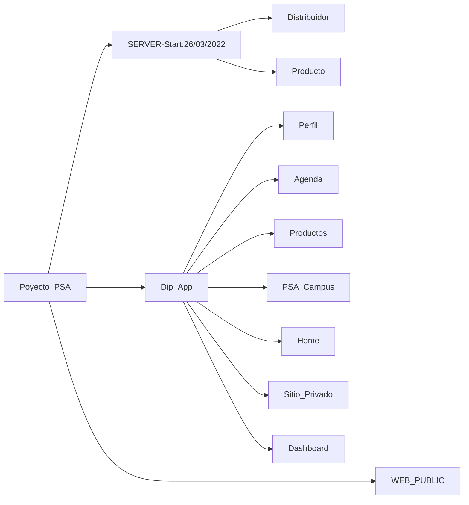

### package.json
```js
{
  "name": "psa-server",
  "version": "1.0.0",
  "description": "",
  "main": "index.js",
  "scripts": {
    "start": "npx nodemon index.js"
  },
  "dependencies": {
    "express": "^4.18.2",
    "nodemon": "^2.0.20"
  }
}
```
[Explicacion de la configuración](https://www.youtube.com/watch?v=olTgcd5VjX0)

> linea 6 ==> 10:35


